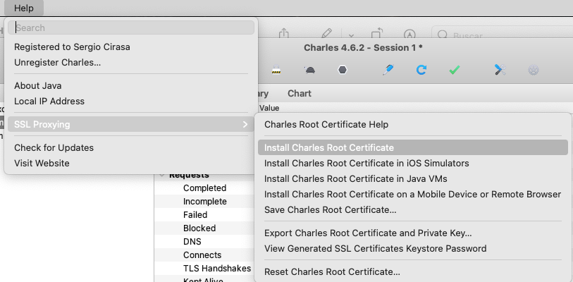
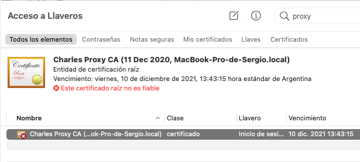
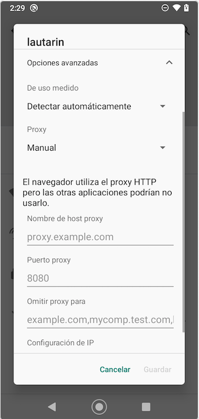
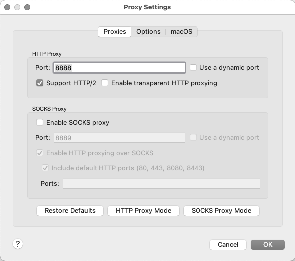
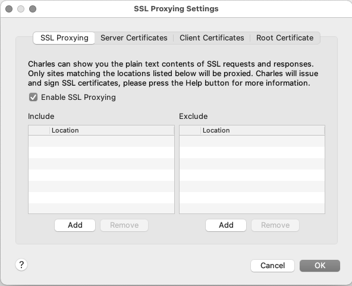

# Charles Proxy: HTTP debugging

Charles es una herramienta que permite interceptar, ver y modificar todo el tráfico HTTP / HTTPS entre la app y el servidor, pudiendo ser la app una aplicación web o mobile que corre en un dispositivo físico o emulador.

***Download:*** https://www.charlesproxy.com/


Cuando el proxy SSL esta habilitado, Charles recibe el certificado del servidor y el browser o aplicacion va a recibir el certificado de Charles. Dado que estos no van a confiar en el certificado es necesario instalar el certificado root en la computadora o dispositivo.


- [Setups for Browser Debugging](#setups-for-browser-debugging)
- [Setups for Android Debugging](#setups-for-android-debugging)
- [Setups for iPhone Debugging](#setups-for-iphone-debugging)
- [Setups for iPhone Simulator Debugging](#setups-for-iphone-simulator-debugging)
- [Start Debugging:](#start-debugging)
  - [Modificar las respuestas](#modificar-las-respuestas)
  - [Agregar delay a las respuestas](#agregar-delay-a-las-respuestas)
  - [Ejecutar un request repetidamente](#ejecutar-un-request-repetidamente)
  - [Breakpoints](#breakpoints)


## Setups for Browser Debugging 

### 1. Instalar el certificado root

Abrir Charles e ir al menu:

```sh
Help --> SSL Proxying --> Install Charles Root Certificate
```



### 2. Autorizar/Confiar en el certificado

Ir al keychain y buscar el certificado instalado ***Charles Proxy CA*** 




luego darle doble click y en la seccion `Confiar` seleccionar `Confiar Siempre`


### 3. Reiniciar el Chrome y Charles

<br/>

## Setups for Android Debugging 

### 1. Descargar e Instalar el certificado root en el dispositivo

Abrir el siguiente link en el dispositivo y una vez descargado abrirlo para instalarlo. Si no se descarga el certificado descargarlo desde la computadora y enviarlo de algun modo al dispositivo.

http://chls.pro/ssl

Al instalar el certificado darle un nombre `Charles` y seleccionar `VPN y aplicaciones`


### 2. Corroborar que se haya instalado

Para corroborar la correcta instalacion o borrar el certificado puede hacerse desde
```sh
Settings --> Seguridad --> Encriptación y credenciales --> Credenciales del usuario
```


### 3. Configurar la conexión entre el dispositivo y la computadora

La computadora y el dispositivo deben estar en la misma red por lo tanto o nos aseguramos que esten conectados la misma red WIFI o compartimos internet desde la computadora y nos conectamos a esta red desde el dispositivo mobile.

### 4. Configurar proxy

Obtener la IP de la computadora:

```sh
ifconfig | grep "inet " | grep -Fv 127.0.0.1 | awk '{print $2}'
```

Para configurar el Proxy se debe ir en el dispositivo a:

```sh
Settings  --> Internet y redes --> Seleccionar la red WiFi --> Settings --> Edit
```
 Dentro de opciones avanzadas en la sección proxy seleccionar manual y en `host` ingresar la IP de la computadora y en puerto `8888`



<br/>

### 5. Configurar Aplicación Android

***Source:*** https://developer.android.com/training/articles/security-config

#### Agregar en el proyecto Android el archivo `res/xml/network_security_config.xml`

```xml
<?xml version="1.0" encoding="utf-8"?>
<network-security-config>
    <base-config>
        <trust-anchors>
            <!-- Trust preinstalled CAs -->
            <certificates src="system" />
            <!-- Additionally trust user added CAs -->
            <certificates src="user" />
        </trust-anchors>
    </base-config>
</network-security-config>
```


#### Agregar el archivo de configuración de seguridad de red en el manifest

```xml
    <?xml version="1.0" encoding="utf-8"?>
    <manifest ... >
        <application android:networkSecurityConfig="@xml/network_security_config"
                        ... >
            ...
        </application>
    </manifest>
```

### Setups for iPhone Debugging 

<br/>

### Setups for iPhone Simulator Debugging 

## Start Debugging 

### Setup Charles

#### 1. Configurar el puerto `8888`

```sh
Menu --> Proxy  --> Proxy Settings
```



#### 2. Agregar el host que se quiere inspeccionar en:

```sh
Menu --> Proxy  --> SSL Proxying Settings
```




#### 3. Start SSL:

```sh
Menu --> Proxy  --> Start SSL Proxying
```


Como resultado podrá empezar a ver el trafico entre la aplicación y el servidor.


### Modificar las respuestas

Para poder modificar la respuesta de un request se debe ir a:
```sh
Menu --> Tools  --> Rewrite...
```

***Se pueden crear rules para:***
* Add/Modify/Remove Header
* Host
* Path URL
* Add/Modify/Remove Query Params
* Response Status
* Body

#### 1. Agregar/Configurar el request involucrado


#### 2. Agregarle rules al request para que sobreescriba parte del body

Por ejemplo en este caso se configura para que la aparicion de cierto string en el body sea remplazado por otro.


Como se puede observar se recibira el valor configurado


#### 3. Agregarle rules al request para modificar el status code

También se puede editar el status code, esto puede util para testear diferentes casos de uso como por ejemplo podría ser la expiración de la sesión.


### Agregar delay a las respuestas


Ir a la siguiente sección:

```sh
Menu --> Proxy  --> Throttle Settings...
```
 
y configurar el host en `Location` y agregar una latencia al request.


Por ultimo habilitar la funcionalidad desde:

```sh
Menu --> Proxy  --> Start Throttling
```

### Ejecutar un request repetidamente

Desde la siguiente seccion se puede ejecutar un request de forma concurrente y repetida, esto puede servir para ver como se comporta el servidor ante cierta carga.

```sh
Menu --> Tools  --> Advanced Repeat...
```


### Breakpoints

Los breakpoints permiten interceptar los request o response y `editarlos on the fly`. Para esto es necesario configurarlos desde:

```sh
Menu --> Proxy  --> Breakpoint Settings...
```

Se debe configurar el location:


y por ultimo habilitar los breakpoints:

```sh
Menu --> Proxy  --> Enable Breakpoints
```

Una vez hecho esto cada vez que se ejecute el request Charles nos notificara y noes permitira editarlo.

Algo importante a tener en cuenta es que editarlo puede llevarnos un tiempo por ende la aplicación podria llegar a dar timeout, por eso mismo es probable que antes haya que setear en la aplicación un timeout alto.


